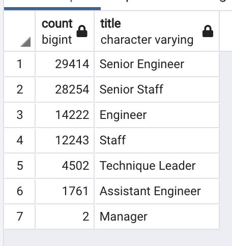
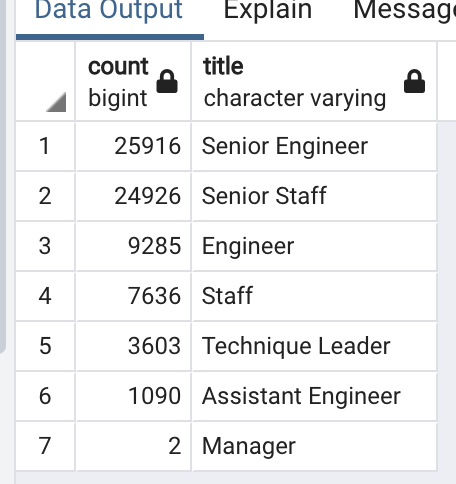
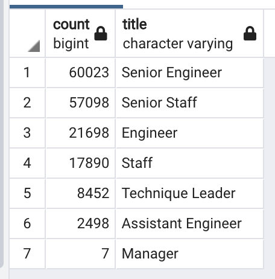

# Pewlett-Hackard Retirement Eligbility

## Overview
Pewlett-Hackard is faces an upcoming challenge due to its aging workforce. The company will need a strategic plan for the upcoming transition as large numbers of senior, experienced employees will likely leave in a short period of time. The current analysis begins to assess the scope of the issue, identifying these employees and which positions within the company are going to be most affected. 
Next, employee information is provided for individuals who may be candidates for a proposed mentorship program, working with retiring employees to prepare for taking on those positions. 

## Results
- The most recent titles for employees who are soon retirement eligible age are most likely to be Senior Engineer and Senior Staff, combining for over 50,000 individuals.

#### Retirement age employees grouped by most recent job title

- Two managers are in this age bracket. These roles will likely be the most important to fill, but will also require an inividualized approach to identifying potential replacements. 

- There were 1549 individuals identified as eligible for the proposed mentorship program.

- The total number of individuals included in the table for retirement by title is 133776. This number does not make sense given our earlier analysis identified only 33,118 current employees at retirement age. 

## Summary
The table above, with the number of individuals with each title, includes all individuals who have been employees, and are now approaching retirement eligible age. However, it was not constrained on current status of employment, and thus includes individuals who no longer work for the company. I went back to the queries and added the constraint of current employment. Almost 18000 individuals were filtered out, leaving a new table. 

#### Current employees reaching retirement age grouped by job title

While there are fewer employees at every title other than manager, the change is larger proportionally for those in more junior positions. There remain 50,000 individuals in senior roles who will be retiring, but there is less cause for concern regarding retirement in more junior roles. 

The analysis identified 1549 individuals who would be eligible for the mentorship program. These individuals are all current employees of the company. However, they are chosen by date of birth, 1965. The youngest employees in the dataset have a birthdate of 2/1/65, so the parameter used to define potential mentees, includes only individuals born in one month. A narrow window of date of birth is unlikely to be a good or appropriate choice as a filter. It is more important to identify the employees likely to benefit most from mentoring. Employees currently in more junior roles, could be trained by senior colleagues. I ran a query which includes all remaining current employees, grouped by their current job title. 

#### Remaining employees grouped by job title
 

There are 21698 Engineers, and 17890 Staff, who could be mentored to help them more easily transition into senior roles, with 25916 Senior Engineers, and 24926 Senior Staff members to potentially serve as mentors. There are also currently 2498 Assistant Engineers who could be mentored by the 9285 retiring Engineers. 

The proposed mentorship program should help to reduce the loss of experience. In addition the compmany will then need to look at recruitment strategies to fill the remaining vacancies that will be created in senior roles, and also increase hiring of new employees with less experinece.
